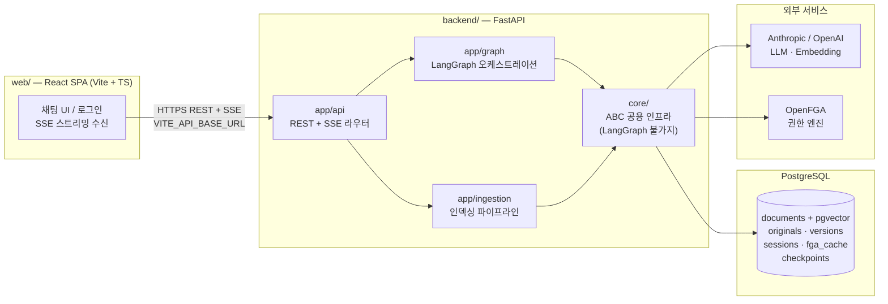
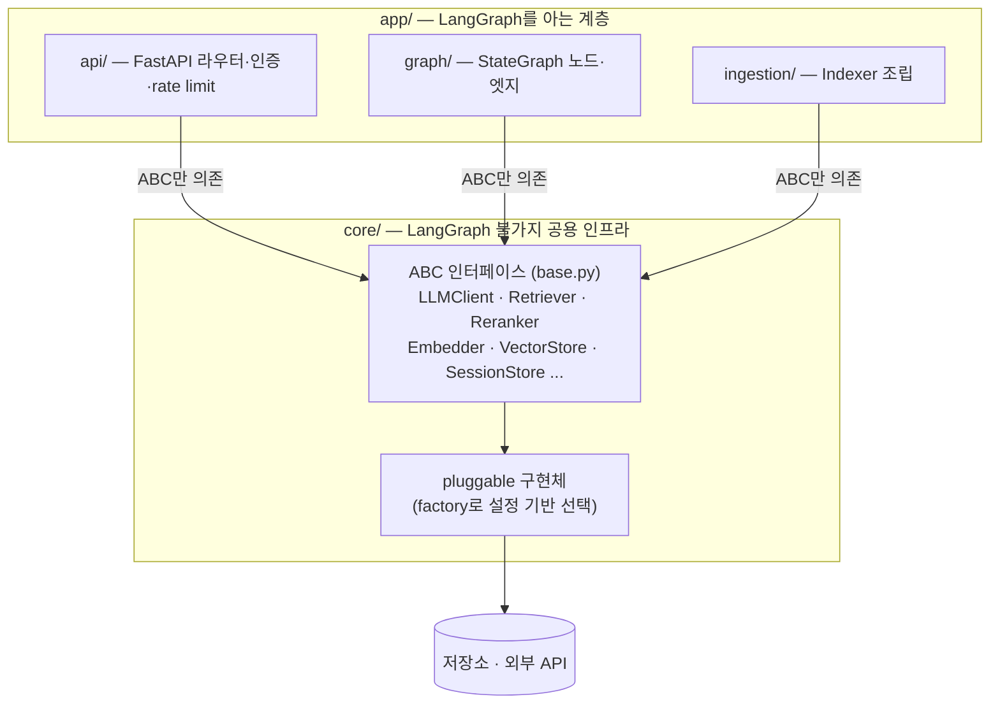
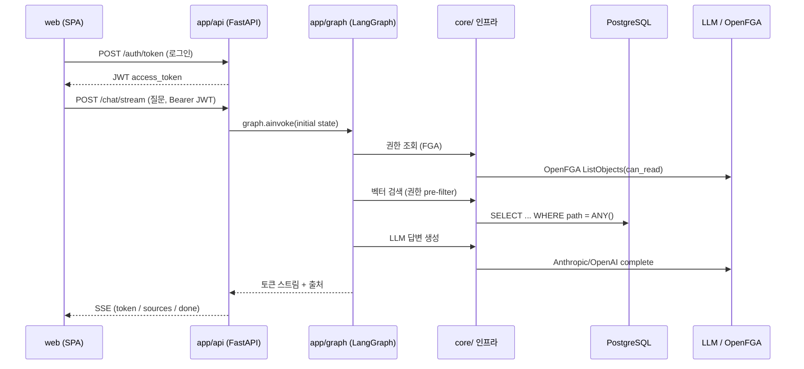
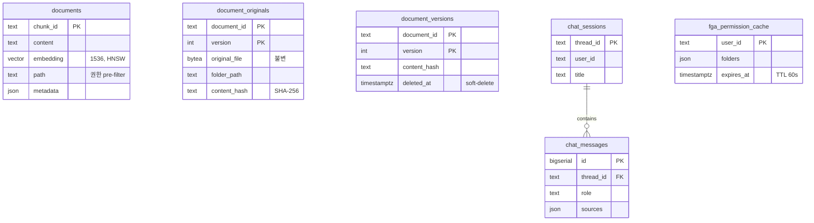

# 시스템 구성도 — 전체 개요 (대분류)

> company-rag 모노레포 전체의 고수준 시스템 구성도.
> 백엔드 내부의 RAG 그래프·권한제어·인제스천 상세는 [backend-internals.md](./backend-internals.md) 참조.

`company-rag`는 LangGraph 기반 사내 문서 RAG 챗봇이다. 프론트엔드(`web/`)와 백엔드(`backend/`)가 형제 관계인 모노레포로 구성되며, 모든 통신은 백엔드 REST/SSE API를 통해서만 이루어진다.

---

## 1. 전체 구성

- **web/** — 백엔드 코드를 직접 참조하지 않고 `VITE_API_BASE_URL` API로만 통신한다.
- **backend/** — `app/`(API·그래프·인제스천)과 `core/`(공용 인프라)로 나뉜다.
- **PostgreSQL** — 벡터·세션·원본·권한캐시·그래프 체크포인트를 단일 DB에 통합(Redis 미사용).
- **외부 서비스** — LLM/임베딩 provider와 OpenFGA 권한 엔진은 `core/` 인터페이스 뒤에 격리된다.

---

## 2. 레이어 경계 (절대 규칙)

핵심 불변식 (`backend/CLAUDE.md`):

| 규칙 | 내용 |
|------|------|
| `core/`는 LangGraph를 모른다 | `core/` 어디에도 `langgraph` import 없음. 순수 도메인 로직만. |
| `app/`은 `core/`의 ABC만 의존 | 구현체는 `lifespan`에서 생성 후 `app.state`로 주입. |
| `app/graph/nodes/`는 순수 함수 | State in → State out. side effect는 `core/` 호출로만. |

구현체는 `factory`로 설정(`.env`) 기반 교체된다 — LLM(Anthropic↔OpenAI), Embedder(OpenAI↔SentenceTransformers), 캐시·세션(Postgres↔Memory) 등.

---

## 3. 요청 데이터 흐름 (채팅 1턴)

- 인증: `/auth/token`으로 JWT 발급(`config/users.yaml` 기반) → 이후 모든 요청 `Authorization: Bearer`.
- 채팅: `POST /chat/stream`이 LangGraph 그래프를 실행하고 **Server-Sent Events**로 토큰·출처·완료 이벤트를 흘려보낸다.
- 그래프 내부 노드 토폴로지·권한 pre-filter 상세는 [backend-internals.md](./backend-internals.md) 참조.

---

## 4. 컴포넌트 인벤토리

### 4.1 프론트엔드 (`web/src/`)

| 영역 | 구성 | 역할 |
|------|------|------|
| `api/` | `client.ts` | `apiFetch()` HTTP 래퍼 + `streamChat()` SSE 제너레이터. 401→로그아웃, 429→retry-after 처리 |
| `auth/` | `AuthContext`, `LoginPage` | JWT를 localStorage에 보관, `/auth/me`로 프로필 로드 |
| `chat/` | `ChatPage`, `MessageList`, `MessageInput`, `SessionSidebar`, `MarkdownRenderer`, `SourceBadge` | 채팅 UI, 세션 사이드바, 마크다운·출처 렌더링 |

스택: React 18 · TypeScript 5 (strict) · Vite 5 · react-router 6 · TailwindCSS 3 · 상태관리는 Context API, HTTP는 네이티브 `fetch`(별도 라이브러리 없음).

### 4.2 백엔드 API 라우터 (`app/api/`)

| 라우터 | 대표 엔드포인트 | 역할 |
|--------|----------------|------|
| `auth` | `POST /auth/token`, `GET /auth/me` | JWT 발급·현재 사용자 |
| `chat` | `POST /chat`, `POST /chat/stream` | 단발/스트리밍 RAG 답변 |
| `sessions` | `GET /sessions`, `GET /sessions/{id}/messages`, `DELETE /sessions/{id}` | 세션 이력 관리 |
| `documents` | `GET /documents/download` | 원본 파일 다운로드 (FGA 권한 검사) |
| `admin` | `/admin/index/*`, `/admin/eval/*`, `/admin/cost/report`, `/admin/users` | 인덱싱·평가·비용·사용자 (admin role 필수) |

모든 의존성(core 구현체)은 `lifespan`에서 생성되어 `app.state`에 주입되고, `deps.py`가 `get_current_user`·`get_fga_client`·`check_rate_limit` 등으로 핸들러에 공급한다.

### 4.3 core/ 공용 인프라 (19개 모듈)

| 모듈 | 역할 | 매핑 기술 |
|------|------|----------|
| `llm` | LLM 통합 (ABC) | Anthropic / OpenAI |
| `embedder` | 텍스트→벡터 (ABC) | OpenAI / SentenceTransformers |
| `vector_store` | 청크+임베딩 저장·검색 (ABC) | PostgreSQL + pgvector (HNSW) |
| `retriever` | 질문→임베딩→검색 (ABC) | vector_store + embedder |
| `reranker` | 검색결과 재정렬 (ABC) | LLM / RRF / NoOp |
| `chunker` | 문서→청크 (ABC) | 고정크기 슬라이딩 윈도우 |
| `loader` | 파일→문서 (ABC) | Markdown / MultiFormat |
| `parser` | bytea→Markdown (ABC) | PDF / Markdown |
| `indexer` | 인제스천 조율 | loader+chunker+embedder+store |
| `document_original` | 원본(bytea) 보관 (ABC) | PostgreSQL |
| `document_version` | 버전 이력 | PostgreSQL |
| `fga` | OpenFGA 권한+캐시 (ABC) | OpenFGA SDK + PostgreSQL TTL 캐시 |
| `auth` | JWT 발급·검증 | PyJWT (HS256) |
| `session` | 채팅 세션 이력 (ABC) | PostgreSQL / Memory |
| `rate_limiter` | API 속도제한 (ABC) | 슬라이딩 윈도우 (in-memory) |
| `observability` | 추적·비용 측정 | tracer / cost_tracker |
| `orchestrator` | 파이프라인 스텝 실행 | step/pipeline |
| `config` | 환경변수 설정 로딩 | dotenv |
| `models` | 도메인 데이터 클래스 | dataclass |

---

## 5. 데이터 저장소 (PostgreSQL 단일 DB)

| 테이블 | 용도 | 담당 모듈 |
|--------|------|----------|
| `documents` | 청크 + 임베딩 (벡터 검색) | `vector_store.postgres_store` |
| `document_originals` | 원본 파일(bytea), 다운로드·증빙 | `document_original.postgres_store` |
| `document_versions` | 문서 버전 이력(soft-delete) | `document_version.postgres_store` |
| `chat_sessions` / `chat_messages` | 세션 메타·메시지 | `session.adapters.postgres` |
| `fga_permission_cache` | 사용자별 읽기 가능 폴더 캐시 | `fga.cache.postgres` |
| `langgraph_checkpoints` | 그래프 상태(HITL 복구) | langgraph(`AsyncPostgresSaver`) |

> 설계 결정: FGA 캐시는 Redis 대신 PostgreSQL TTL 캐시 사용(기존 DB 재사용, TTL 60초로 충분). 근거 ADR-0009.

---

## 6. 기술 스택 요약

| 구분 | 기술 |
|------|------|
| 프론트 | React 18, TypeScript 5, Vite 5, react-router 6, TailwindCSS 3, Vitest |
| 백엔드 | Python 3.11+, FastAPI, LangGraph, langchain-anthropic |
| LLM / 임베딩 | Anthropic Claude / OpenAI (설정으로 교체) |
| 벡터 검색 | PostgreSQL + pgvector (HNSW) |
| 권한 | OpenFGA (department/folder 트리) + PostgreSQL TTL 캐시 |
| 인증 | JWT (PyJWT, HS256) |
| 통신 | REST + Server-Sent Events (스트리밍) |

---

## 부록 — 참조

- 백엔드 내부 상세 구성도: [backend-internals.md](./backend-internals.md)
- 권한 RAG 설계: `backend/DESIGN.md`
- 결정 기록: `backend/docs/superpowers/decisions/` (ADR-0009 FGA 캐시, ADR-0013 다중 포맷 인제스천 등)
