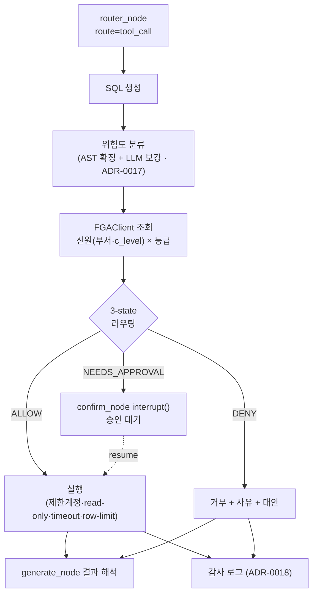

# ADR-0016: 신원 × 위험도 교차 게이트로 자율 SQL 도구를 통제한다

> **Status**: 🟣 대체됨 → [ADR-0028](ADR-0028-capability-permission-model.md)
>
> 게이트 *메커니즘*(코드 `_MATRIX`/`gate_lookup`/`identity_tier`)만 OpenFGA capability Check로 대체됐다. 위험도 분류(ADR-0017)와 3-state 어휘(ADR-0027 `JUSTIFY_AND_APPROVE`)는 그대로 유지된다.

**Date**: 2026-06-02
**Context**: `tool_call` 자율 도구 루프에 첫 실(實)DB 도구인 **"DB 질의(자연어 → SQL 생성·실행)"**를 추가한다. SQL 실행은 read-only가 아니므로 — `DROP`/`UPDATE` 한 번이 돌이킬 수 없으며, **누가** 질의했느냐에 따라 같은 SQL도 허용·차단이 갈려야 한다. 모든 실행을 신원 × 위험도 교차로 `ALLOW / DENY / NEEDS_APPROVAL` 3-state 게이팅한다. 기존 자산(OpenFGA 부서·c_level 트리 · `interrupt` HITL · AsyncPostgresSaver 체크포인트)을 재사용한다.

해결해야 할 두 어려움:
- **분기 불확실성** — 자연어를 SQL로 파싱하기 전엔 위험도를 알 수 없다.
- **회색지대** — 같은 `UPDATE`도 일반 부서원에겐 차단, engineering엔 승인대기여야 한다. 단순 RBAC로는 "행위자 × 행동 위험도"의 2차원 판단을 표현하기 어렵다.

## Options

| 선택지 | 트레이드오프 |
|--------|------------|
| 에이전트 없이 사전 규칙/RBAC 미들웨어로만 차단 | 단순·검증 쉬움. 그러나 비정형 질문("매출 빠진 거 봐줘")의 테이블·조인 추론 불가, 회색지대 표현 불가 |
| Text-to-SQL + 위험도까지 LLM에 위임 | 구현 빠름. 그러나 프롬프트 우회에 취약, "AI가 위험하다 판단함"은 방어력 0 |
| 신원 무관, 위험도만 보고 단일 정책 게이팅 | 매트릭스 유지보수 부담 없음. 그러나 "같은 질문, 다른 결과"라는 핵심 차별점 소멸 |
| **신원(OpenFGA 부서·c_level) × AST 확정 위험도 교차 → 3-state** | 회색지대를 게이트로 표현, 기존 자산 전부 재사용, AST 확정으로 우회 방어. 위험도 분류 노드가 핵심 의존점, 가상 업무 DB·감사로그 등 인프라 분리 전제 |

## Decision

**선택: 질문자의 신원(부서·c_level)과 SQL 위험도를 교차해 모든 실행을 3-state로 게이팅한다.**

- 데모의 무게중심은 "자연어로 SQL을 짜준다"가 아니라 **"같은 질문을 일반 부서원과 c_level이 했을 때 한쪽은 실행, 한쪽은 차단되는 장면"**이다.
- 위험도는 LLM 단독이 아니라 **AST 파서로 확정 + LLM으로 보강**한다 (상세: [ADR-0017](ADR-0017-sql-risk-classification.md)).
- `NEEDS_APPROVAL`은 기존 `confirm_node`의 `interrupt()`/resume(AsyncPostgresSaver)에 그대로 얹는다 — 신규 HITL 인프라 불필요.
- 권한 판단과 **별개로** 실행 자체를 가둔다: SQL 도구는 **가상 업무 DB**(직원·매출 등 시드 스키마)에만 붙고, **제한 계정 · read-only 트랜잭션 · 타임아웃 · row limit**으로 가둔다. RAG 운영 DB(문서청크·세션·FGA)에는 절대 붙이지 않는다.
- 모든 게이트 결정·실행은 **감사 로그**에 남긴다 (상세: [ADR-0018](ADR-0018-decision-audit-log.md)).

### 권한 매트릭스 (출발점, 등급 경계는 조정 가능)

> **개정됨**: 명칭 `NEEDS_APPROVAL` → `JUSTIFY_AND_APPROVE` 및 c_level 대량·PII 셀이 [ADR-0027](ADR-0027-justify-and-approve-self-service-gate.md)에서 갱신되었다. 아래 매트릭스·본문의 `NEEDS_APPROVAL`은 본 ADR 결정 당시의 명칭(역사 기록)이며, **현행 명칭·매트릭스는 ADR-0027을 따른다.**

신원 축은 신규 권한주체 도입 없이 기존 모델로 매핑한다 — `일반 부서원`(특수 역할 없는 department member) / `engineering`(기술 부서원) / `c_level`(super_reader 역할).

| SQL 위험도 | 일반 부서원 | engineering | c_level |
|-----------|:----------:|:-----------:|:-------:|
| SELECT (일반 읽기) | ALLOW | ALLOW | ALLOW |
| 대량 SELECT (풀스캔 · PII 포함) | NEEDS_APPROVAL | NEEDS_APPROVAL | ALLOW |
| UPDATE / DELETE | DENY | NEEDS_APPROVAL | NEEDS_APPROVAL |
| DDL (DROP / ALTER) | DENY | DENY | **DENY** |

> DDL은 자율 루프에서 **전 계층 차단**한다(c_level도 NEEDS_APPROVAL이 아닌 DENY). 스키마 변경은 에이전트의 책임 범위 밖으로 두고, 사람이 별도 경로로만 수행한다.

### 에이전트 루프 (목표 설계 — 기존 그래프에 SQL 경로 삽입)

## Rationale

- **"동일 질문이 행위자에 따라 갈린다"를 단일 게이트로 표현** → 데모 임팩트 + OpenFGA·체크포인트 자산 재사용. 신원 축을 기존 부서·c_level로 매핑해 신규 권한주체 도입을 피한다.
- **AST 확정 기반이라 프롬프트 우회를 구조적으로 차단** (예: `SELECT`로 위장한 서브쿼리). AST 미지원/모호 구문은 **보수적으로 DENY** (ADR-0017).
- **기존 HITL 재사용**: `NEEDS_APPROVAL`이 곧 기존 `confirm_node`의 `interrupt()`다. tool_call 경로에 이미 interrupt/resume이 깔려 있어(`app/graph/nodes/confirm.py`, AsyncPostgresSaver) 신규 인프라 비용이 없다.
- **실행 격리**: 권한과 별개로 가상 업무 DB·제한계정·read-only로 가둬, 게이트가 뚫려도 영향 범위를 제한한다.

## 미해결 / 후속 (착수 전 전제)

- **`AgentState` 확장**: `generated_sql`/`sql_risk`/`gate_decision` 필드 추가(TypedDict 확장만, 임의 dict 금지 — CLAUDE.md 규칙 2).
- **가상 업무 DB 시드**: 직원·매출 등 시연용 업무 스키마 + 제한 계정 신규 구축. RAG 운영 DB와 물리/논리 분리.
- **위험도 분류 노드 = 단일 실패점**: 정확도가 전체 신뢰도를 좌우 → [ADR-0017](ADR-0017-sql-risk-classification.md)에서 별도 결정.
- **감사 로그 인프라 부재**: 현재 코드에 권한/실행 감사 로그가 없음 → [ADR-0018](ADR-0018-decision-audit-log.md)에서 신규 구축.
- **DoD**: tool_call 경로 단위 테스트, 게이트 매트릭스 회귀, 새 의존성(sqlglot 등) ADR 작성.

## 영향받는 결정

- [ADR-0017](ADR-0017-sql-risk-classification.md) — 위험도 분류 전략(AST + LLM). 본 ADR의 단일 실패점을 다룸.
- [ADR-0018](ADR-0018-decision-audit-log.md) — 감사 로그 인프라. 본 ADR이 "기존 자산"으로 전제했으나 실제로는 신규 구축 대상.
- `project_next_agentic_tools` — tool_call 자율 도구 루프 정식화의 첫 실DB 도구가 본 ADR이다.
