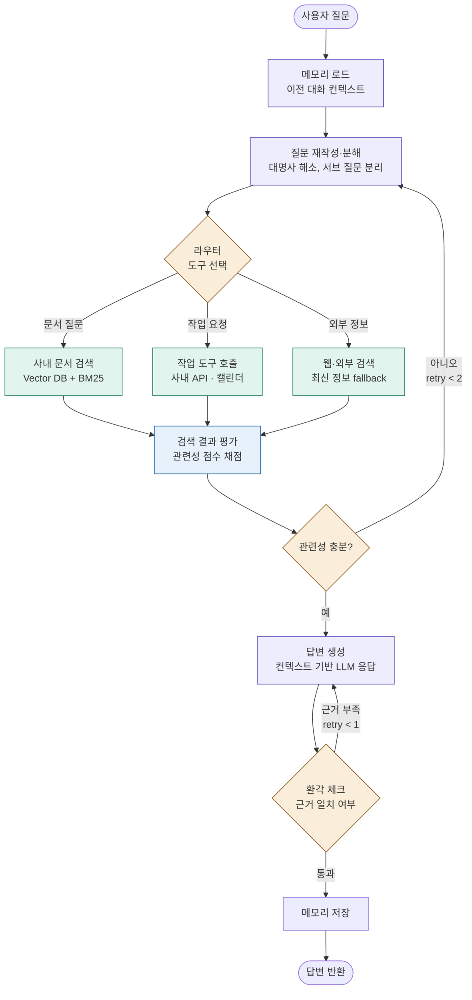

# 사내 Agentic RAG 에이전트 프로젝트 기획안

> AI 에이전트(Claude Code 등)에게 작업을 위임하기 위한 작업 명세서.
> 각 Phase는 독립적으로 동작 가능하며, 이전 Phase의 산출물 위에 점진적으로 쌓는다.

---

## 1. 프로젝트 개요

### 1.1 목표
사내 직원이 자연어로 질문하면, 사내 문서 검색과 작업 도구 호출을 자율적으로 선택해 답변하는 **Agentic RAG 챗봇**을 구축한다.

### 1.2 핵심 요구사항
- **Q&A 능력**: 사내 문서(위키, 정책, 매뉴얼 등) 기반 답변
- **작업 보조**: 캘린더 조회, 사내 API 호출 등 실제 액션 수행
- **신뢰성**: 환각(hallucination) 최소화, 출처 인용
- **연속 대화**: 멀티턴 컨텍스트 유지

### 1.3 비기능 요구사항
| 항목 | 기준 |
|------|------|
| 응답 시간 | 단순 Q&A 5초 이내, 도구 호출 포함 10초 이내 |
| 정확도 | 평가셋 기준 80% 이상 (Phase별 회귀 테스트) |
| 환각률 | 5% 이하 (Hallucination Check 노드 통과율 기준) |
| 동시 사용자 | 초기 50명, 확장 가능한 구조 |

---

## 2. 기술 스택

### 2.1 권장 스택
| 영역 | 선택 | 비고 |
|------|------|------|
| 오케스트레이션 | **LangGraph** (Python) | 그래프 기반 워크플로우 |
| LLM | Claude Sonnet 4.5 / GPT-4o | 환경에 따라 선택 |
| 임베딩 | OpenAI `text-embedding-3-small` 또는 `bge-m3` | 한국어면 bge-m3 권장 |
| Vector DB | **Qdrant** 또는 PostgreSQL + `pgvector` | 운영 부담 적음 |
| 키워드 검색 | Elasticsearch / OpenSearch | Hybrid Search용 |
| 캐시 | Redis | 쿼리 결과·세션 캐싱 |
| 백엔드 API | FastAPI (Python) | LangGraph와 동일 런타임 |
| 프론트엔드 | Next.js + Vercel AI SDK | 스트리밍 UI 빠른 구현 |
| 관측성 | LangSmith + Grafana/Loki | 트레이싱과 메트릭 분리 |
| 컨테이너 | Docker + docker-compose | 로컬 개발 환경 통일 |

### 2.2 디렉토리 구조
```
agentic-rag/
├── app/
│   ├── graph/                  # LangGraph 정의
│   │   ├── state.py            # State 스키마
│   │   ├── nodes/              # 노드별 함수
│   │   │   ├── memory.py
│   │   │   ├── rewrite.py
│   │   │   ├── router.py
│   │   │   ├── retrieve.py
│   │   │   ├── grade.py
│   │   │   ├── generate.py
│   │   │   └── hallucination.py
│   │   ├── edges.py            # 조건부 분기 로직
│   │   └── builder.py          # 그래프 조립
│   ├── tools/                  # 에이전트가 호출할 도구
│   │   ├── vector_search.py
│   │   ├── internal_api.py
│   │   └── web_search.py
│   ├── ingestion/              # 문서 인덱싱 파이프라인
│   │   ├── chunker.py
│   │   ├── embedder.py
│   │   └── indexer.py
│   ├── api/                    # FastAPI 엔드포인트
│   │   ├── chat.py
│   │   └── admin.py
│   └── config.py
├── tests/
│   ├── unit/
│   ├── integration/
│   └── eval/                   # 평가셋 + 회귀 테스트
│       ├── dataset.jsonl
│       └── run_eval.py
├── docker-compose.yml
└── pyproject.toml
```

---

## 3. State 스키마

LangGraph의 모든 노드가 공유하는 상태 정의. **이게 첫 단추이므로 가장 먼저 확정해야 한다.**

```python
from typing import TypedDict, Annotated, Literal
from operator import add

class AgentState(TypedDict):
    # 입력
    question: str                                  # 원본 사용자 질문
    rewritten_question: str                        # 재작성된 질문
    chat_history: list[dict]                       # 이전 대화 (role, content)

    # 라우팅
    route: Literal["doc_search", "tool_call", "web_search"]

    # 검색 결과
    documents: Annotated[list[dict], add]          # 누적 가능
    relevance_score: float                         # 0.0 ~ 1.0
    retry_count: int                               # 무한 루프 방지

    # 출력
    answer: str
    citations: list[str]
    hallucination_passed: bool
```

---

## 4. 단계별 Phase 계획

> **원칙**: 각 Phase는 동작하는 시스템을 만든다. Phase 1만으로도 데모 가능해야 한다.

### Phase 1: 기본 RAG 파이프라인 (1주)

**목표**: 사내 문서 검색 → 답변 생성의 단순 흐름을 LangGraph로 구현.

**작업 항목**
1. ✅ 문서 인덱싱 파이프라인 구축 (`app/ingestion/`) — chunker, embedder, indexer 구현 완료
2. ✅ State 스키마 정의 (`app/graph/state.py`) — `AgentState(TypedDict)` 완성
3. ✅ 2개 노드 구현 (`app/graph/nodes/`) — `retrieve_node` → `generate_node`
4. ✅ FastAPI `/chat` 엔드포인트 (`app/api/chat.py`) — 스트리밍 미구현 (Phase 2에서 추가 예정)
5. ⬜ **평가셋 20~30개 구축** — 현재 5개 (`tests/eval/questions.yaml`), 보충 필요

**Definition of Done**
- [x] ~~임의의 사내 문서 100건 인덱싱 완료~~ → 15개 사내 문서 81 청크 인덱싱 완료 (`docs/company/`)
- [x] curl로 `/chat` 호출 시 출처 포함 답변 반환
- [x] 평가셋에서 정답률 측정 완료 (베이스라인 기록)
  - recall@5: **0.60** / keyword_hit: **0.80** (5개 질문 기준, 2026-05-22)
  - 취약: 연차(recall=0), 온보딩(recall=0) — Phase 2 Self-RAG로 개선 목표
- [ ] LangSmith 트레이싱 연동

**의존성**: 없음 (출발점)

---

### Phase 2: Self-RAG 요소 추가 (2주)

**목표**: 검색 품질 평가와 환각 체크를 통한 자기 검증 루프 추가.

**작업 항목**
1. `rewrite_query` 노드: 모호한 질문 명확화, 서브 질문 분해
2. `grade_documents` 노드: LLM이 검색 결과의 관련성을 0~1로 채점
3. `check_hallucination` 노드: 답변이 문서에 근거하는지 검증
4. 조건부 엣지 구현
   - 관련성 부족 → `rewrite_query`로 루프백 (최대 2회)
   - 환각 감지 → `generate`로 루프백 (최대 1회)
5. `retry_count`로 무한 루프 방지

**Definition of Done**
- [ ] Phase 1 평가셋에서 정답률 10% 이상 향상
- [ ] 환각 발생률 측정 가능
- [ ] 루프백 발생 시 LangSmith에서 시각적 확인 가능

**의존성**: Phase 1

---

### Phase 3: Agent화 — 도구 선택 (2주)

**목표**: 질문 유형에 따라 도구를 자율 선택하는 라우터 추가.

**작업 항목**
1. `router` 노드: 질문을 분석해 도구 선택
   - `doc_search`: 사내 문서 Q&A
   - `tool_call`: 사내 API 호출 (캘린더, 인사 시스템 등)
   - `web_search`: 외부 정보가 필요한 경우 fallback
2. 도구 인터페이스 통일 (`tools/`)
   - 각 도구는 동일한 입출력 시그니처
3. 도구 호출 결과를 `documents`에 통합
4. 라우팅 실패 시 기본값 처리

**Definition of Done**
- [ ] 3종류 질문 각 10개씩 평가, 올바른 도구 선택률 90% 이상
- [ ] 작업 도구 호출 시 사용자 확인 절차 포함 (안전장치)
- [ ] 도구별 timeout 및 에러 핸들링 완비

**의존성**: Phase 2

---

### Phase 4: 멀티턴 메모리 (1주)

**목표**: 대화 컨텍스트 유지로 자연스러운 연속 대화 구현.

**작업 항목**
1. LangGraph `MemorySaver` 또는 Redis 기반 체크포인터 도입
2. `load_memory` 노드: 이전 대화에서 관련 컨텍스트 추출
3. 세션 ID 기반 대화 격리
4. 토큰 한도 관리 (오래된 대화 요약)

**Definition of Done**
- [ ] "방금 그 문서 더 자세히" 같은 참조 표현 처리 가능
- [ ] 동일 세션 내 5턴 이상 대화 일관성 유지
- [ ] 토큰 폭증 없이 운영 가능

**의존성**: Phase 3

---

### Phase 5: 운영 준비 (1주, 선택)

**목표**: 프로덕션 배포를 위한 마무리 작업.

**작업 항목**
1. 인증·인가 (사내 SSO 연동)
2. 사용자별 권한 기반 문서 필터링 (중요)
3. Rate limiting, 비용 모니터링
4. 어드민 대시보드 (인덱스 관리, 평가셋 운영)
5. 부하 테스트

**Definition of Done**
- [ ] 동시 50명 부하 테스트 통과
- [ ] 비인가 문서 노출 0건
- [ ] 일일 비용 리포트 자동화

---

## 5. 전체 순서도 (최종 아키텍처)



### 색상 범례
- 🟣 **보라**: 기본 파이프라인 노드 (메모리, 재작성, 생성)
- 🟢 **청록**: 도구 노드 (검색, API, 웹)
- 🔵 **파랑**: 평가 노드
- 🟡 **노랑**: 분기점 (라우터, 조건부 엣지)

---

## 6. 노드별 입출력 명세

AI 에이전트가 노드를 구현할 때 참고할 시그니처.

| 노드 | 입력 (State) | 출력 (State 업데이트) | 비고 |
|------|---------------|----------------------|------|
| `load_memory` | `chat_history` (세션 ID로 조회) | `chat_history` | Phase 4 |
| `rewrite_query` | `question`, `chat_history` | `rewritten_question` | LLM 호출 |
| `router` | `rewritten_question` | `route` | LLM 분류 또는 룰 기반 |
| `retrieve_docs` | `rewritten_question` | `documents` | Vector + BM25 Hybrid |
| `call_tool` | `rewritten_question` | `documents` (도구 결과) | 사내 API |
| `web_search` | `rewritten_question` | `documents` | 외부 fallback |
| `grade_documents` | `documents`, `rewritten_question` | `relevance_score` | LLM 평가 |
| `generate` | `documents`, `rewritten_question`, `chat_history` | `answer`, `citations` | 스트리밍 |
| `check_hallucination` | `answer`, `documents` | `hallucination_passed` | LLM 검증 |

---

## 7. 평가 전략

### 7.1 평가셋 구성 (Phase 1에서 구축, 이후 누적)
```jsonl
{"id": "q001", "question": "연차 신청은 어떻게 하나요?", "expected_topics": ["연차", "휴가 정책"], "expected_route": "doc_search"}
{"id": "q002", "question": "다음 주 월요일 회의실 예약해줘", "expected_route": "tool_call"}
{"id": "q003", "question": "최근 LangGraph 업데이트 알려줘", "expected_route": "web_search"}
```

### 7.2 측정 지표
- **정답률**: 키워드 매칭 + LLM-as-a-judge 병행
- **라우팅 정확도**: 의도된 도구를 선택했는가
- **환각률**: `check_hallucination` 실패 비율
- **평균 응답 시간**: P50, P95
- **토큰 비용**: 질문당 평균 비용

### 7.3 회귀 테스트
- 매 Phase 완료 시 전체 평가셋 자동 실행
- 이전 Phase 대비 점수 하락 시 알림
- CI 파이프라인에 통합

---

## 8. 리스크와 대응

| 리스크 | 영향 | 대응 |
|--------|------|------|
| 사내 문서 품질 불균일 | 검색 정확도 저하 | 인덱싱 단계에서 메타데이터 강화, 부서별 가중치 |
| LLM API 비용 폭증 | 운영 부담 | Redis 캐싱, 짧은 질문은 작은 모델 라우팅 |
| 권한 없는 문서 노출 | 정보 유출 | 사용자별 ACL 필터를 Vector DB 쿼리에 강제 |
| 도구 호출 부작용 (잘못된 API 실행) | 사고 발생 | 쓰기 작업은 사용자 confirm 필수 |
| 무한 루프 (Self-RAG) | 응답 지연 | `retry_count` 상한, 타임아웃 |

---

## 9. AI 에이전트 작업 위임 가이드

이 문서를 AI 에이전트에게 전달할 때 권장하는 작업 지시 패턴:

1. **Phase 단위로 위임**: "Phase 1의 Definition of Done을 모두 만족하도록 구현해줘"
2. **State 스키마 먼저 확정**: 3장의 State를 기준으로 모든 노드 구현
3. **각 노드는 단위 테스트와 함께**: `tests/unit/test_<node>.py`
4. **완료 후 평가셋 실행**: 결과를 마크다운으로 리포트
5. **다음 Phase 진입 전 사용자 검수**: 자동으로 다음 단계 진행 금지

---

*문서 버전: v1.0 · 작성일: 2026-05-22*